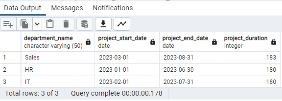
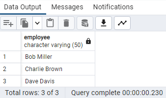
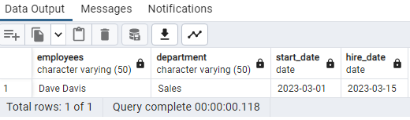
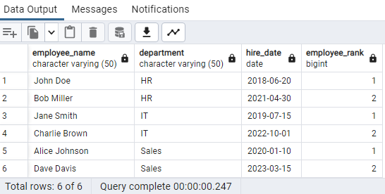
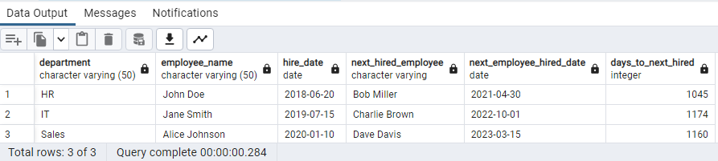

# SQL_CASE_STUDY_HUMAN_RESOURCES

## ABOUT THE CASE STUDY

This is the second SQL case study challenge created by a data community named DATA IN MOTION,LLC. Certain questions were provided which are needed to be answered.

## DATASETS

The Human Resource dataset contains three tables. The table and their columns are below:
- Departments: id, name, manager_id
- Employees: id, name, hire_date, job_title, department
- Projects: id, name, start_date, end_date, department_id

## QUESTIONS

1. Find the longest ongoing project for each department.
2. Find all employees who are not managers.
3. Find all employees who have been hired after the start of a project in their department.
4. Rank employees within each department based on their hire date (earliest hire gets the highest rank).
5. Find the duration between the hire date of each employee and the hire date of the next employee hired in the same department.

## OUTPUT/ANSWER TO EACH QUESTION

1. 

2. 

3. 

4. 

5. 

NOTE: Queries can be found in the file named Human_Resource__Query.sql or in the view code option above.

